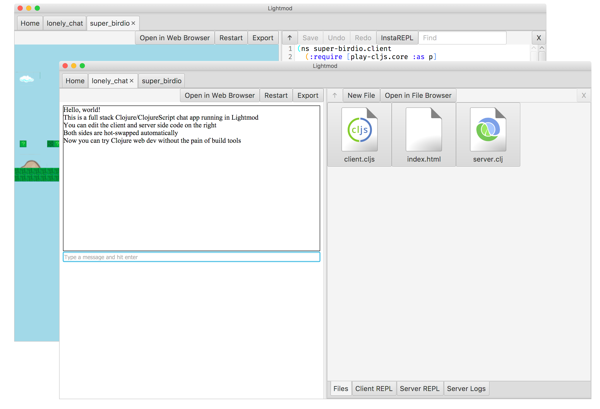

## Introduction

Lightmod is an all-in-one tool for full stack Clojure. See [the website](https://sekao.net/lightmod/) for more information.

## Development

* Install JDK 11 or above
* Install [the Clojure CLI tool](https://clojure.org/guides/getting_started#_clojure_installer_and_cli_tools)
* To develop: `clj -A:app:dev`
* To build the ClojureScript files: `clj -A:app:cljs`
* To build the uberjar: `clj -A:prod uberjar`

## Licensing

All files that originate from this project are dedicated to the public domain. I would love pull requests, and will assume that they are also dedicated to the public domain.
